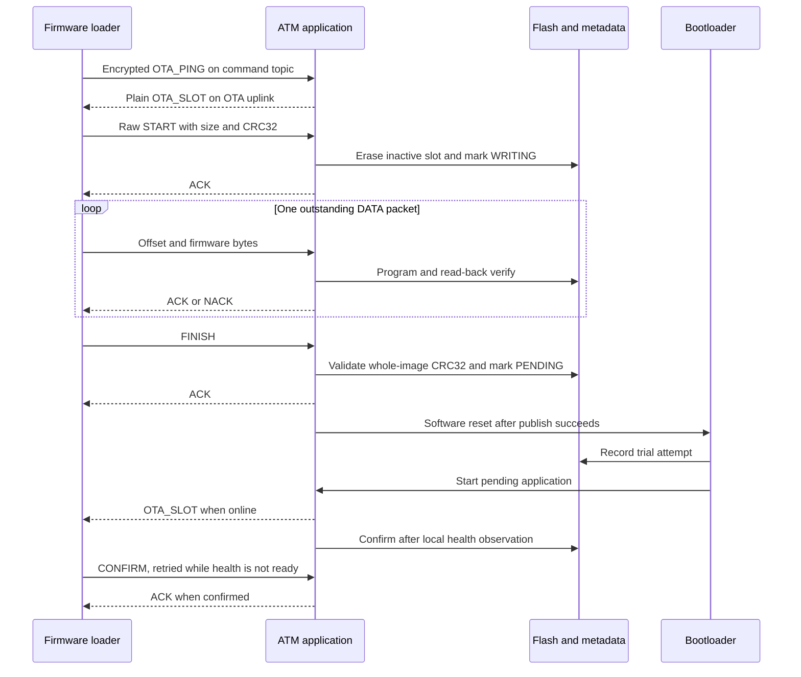

# OTA Architecture

This concept document describes the responsibilities and boundaries of the dual-slot update system.

## Components

| Component | Responsibility |
| --- | --- |
| Firmware loader | Query the running slot, validate the selected image, send packets, and wait for responses |
| MQTT broker | Route messages between the loader and device |
| Device communication layer | Route raw OTA packets separately from encrypted commands |
| OTA receiver | Enforce session state, packet sizes, offsets, and completion rules |
| Flash manager | Erase the target slot, program half-words, verify bytes, and calculate image CRC32 |
| Metadata journal | Persist image states and boot decisions |
| Bootloader | Select an eligible image, record trial attempts, validate vectors, and transfer control |
| Application health monitor | Confirm a healthy trial or stop normal execution so the watchdog can recover |

The bootloader does not download firmware or connect to the broker. An operational ATM application receives and writes the update.

## Flash layout

All end addresses below are exclusive. One KiB means 1024 bytes.

| Region | Start | End | Capacity |
| --- | --- | --- | --- |
| Bootloader | `0x08000000` | `0x08001800` | 6 KiB |
| Slot A | `0x08001800` | `0x08020800` | 124 KiB |
| Slot B | `0x08020800` | `0x0803F800` | 124 KiB |
| Metadata | `0x0803F800` | `0x08040000` | 2 KiB |

Total internal Flash is 256 KiB. Erase pages are 2 KiB; each application slot spans 62 pages. Both applications use the same 48 KiB SRAM region, from `0x20000000` to exclusive end `0x2000C000`.

A firmware image must fit within 126976 bytes. Slot A and slot B are different link targets, not interchangeable storage locations for one position-independent image.

## Update sequence

The local health path does not require the loader to remain connected. If the application is already confirmed when CONFIRM arrives, it returns ACK.

## Download stages

START requires valid metadata, no pending trial, and a running slot that equals the confirmed slot. The receiver selects the opposite slot, erases it, marks it WRITING, and opens a RAM-only session.

DATA is sequential for new bytes. Each accepted chunk is programmed and compared against Flash before progress advances. Verified retransmissions of already written bytes are accepted without another program operation.

FINISH requires the announced byte count and a matching whole-image CRC32. The receiver persists the target as PENDING and the next active slot. It requests an ACK and resets after a successful publish call and a 500 ms delay. A publish error leaves the application running so FINISH can be retried.

ABORT invalidates an in-progress image. It does not erase the current running slot, undo a completed FINISH, or roll back an already booted image.

## Running and active slots

The running slot comes from the processor vector-table base. Metadata `active_slot` is a boot selection field. Immediately after FINISH, metadata can point to the target while the old application is still executing.

Use `OTA_SLOT` to learn what is running. Do not infer the current execution slot from a FINISH ACK alone.

## Boundaries

The update targets application slots only. It does not update the bootloader or migrate the Flash layout. Image CRC32 and vector checks are integrity and plausibility checks, not firmware authentication.

See [boot and metadata](boot-and-metadata.md) for recovery behavior and [limitations](integration-next-steps.md) for cases the current design does not cover.
